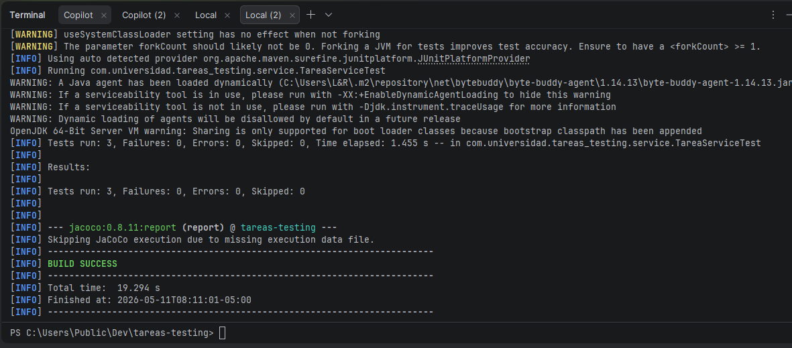
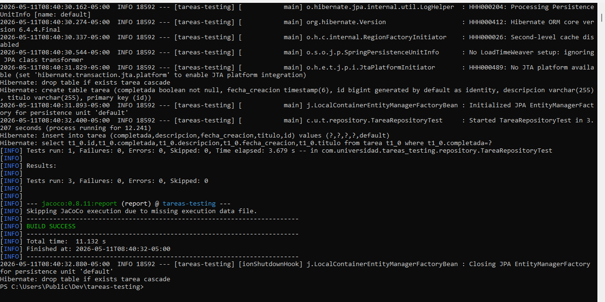
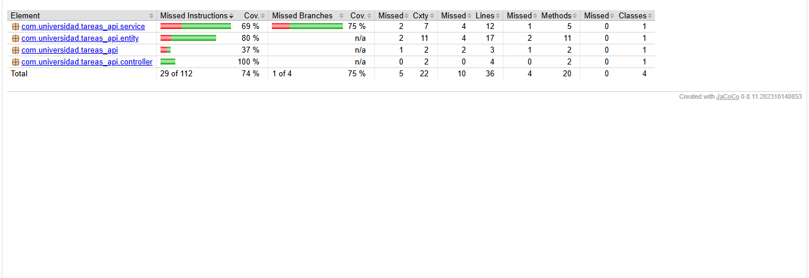

# Suite de Pruebas con JUnit 5, Mockito y JaCoCo - Spring Boot

---

## Autor

- **Nombre:** Jhoseth Esneider Rozo Carrillo
- **Código:** 02230131027
- **Programa:** Ingeniería de Sistemas
- **Unidad:** 10 - Pruebas de Software en Aplicaciones Web
- **Actividad:** Post-Contenido 1
- **Fecha:** 2026

---

## Descripción del Proyecto

Este proyecto consiste en la implementación de una suite de pruebas automatizadas sobre una aplicación Spring Boot para gestión de tareas.

Se desarrollaron pruebas unitarias utilizando JUnit 5 y Mockito, pruebas de integración para controladores y repositorios usando `@WebMvcTest` y `@DataJpaTest`, además de medición de cobertura de código con JaCoCo.

El objetivo principal fue validar el correcto funcionamiento de las diferentes capas de la aplicación y garantizar una cobertura mínima del 70 % en las pruebas.

---

## Objetivo de la Actividad

Implementar pruebas automatizadas en una aplicación Spring Boot aplicando:

- JUnit 5 para pruebas unitarias.
- Mockito para simulación de dependencias.
- `@WebMvcTest` para pruebas de controladores.
- `@DataJpaTest` para pruebas de repositorios.
- JaCoCo para medir y verificar cobertura de código.

---

## Tecnologías Utilizadas

- **Spring Boot 3.2.x** — Framework principal.
- **Java 17** — Lenguaje de programación.
- **Maven 3.9.x** — Gestión de dependencias.
- **JUnit 5** — Framework de pruebas unitarias.
- **Mockito** — Simulación de dependencias.
- **AssertJ** — Validaciones en pruebas.
- **H2 Database** — Base de datos en memoria.
- **JaCoCo 0.8.11** — Cobertura de código.
- **Spring Data JPA** — Persistencia de datos.
- **Spring Web** — Desarrollo de API REST.

---

## Estructura del Proyecto

```text
rozo-post1-u10/
│
├── src/
│   ├── main/
│   │   ├── java/com/universidad/tareas/
│   │   │   ├── controller/
│   │   │   ├── service/
│   │   │   ├── repository/
│   │   │   └── entity/
│   │   │
│   │   └── resources/
│   │
│   └── test/
│       └── java/com/universidad/tareas/
│           ├── service/
│           │   └── TareaServiceTest.java
│           ├── controller/
│           │   └── TareaControllerTest.java
│           └── repository/
│               └── TareaRepositoryTest.java
│
├── evidencias/
│
├── pom.xml
└── README.md
```

---

# Paso 1 - Entidad y Repositorio

---

## Entidad `Tarea`

```java
@Entity
public class Tarea {

    @Id
    @GeneratedValue(strategy = GenerationType.IDENTITY)
    private Long id;

    @NotBlank
    private String titulo;

    private String descripcion;

    private boolean completada = false;

    @CreationTimestamp
    private LocalDateTime fechaCreacion;

    // getters y setters
}
```

---

## Repositorio `TareaRepository`

```java
public interface TareaRepository extends JpaRepository<Tarea, Long> {

    List<Tarea> findByCompletada(boolean completada);
}
```

---

# Paso 2 - Servicio `TareaService`

---

## Clase `TareaService`

```java
@Service
public class TareaService {

    private final TareaRepository repo;

    public TareaService(TareaRepository repo) {
        this.repo = repo;
    }

    public Tarea crear(Tarea tarea) {

        if (tarea.getTitulo() == null || tarea.getTitulo().isBlank()) {
            throw new IllegalArgumentException("El título no puede estar vacío");
        }

        return repo.save(tarea);
    }

    public Tarea buscarPorId(Long id) {

        return repo.findById(id)
            .orElseThrow(() ->
                new EntityNotFoundException("Tarea no encontrada: " + id));
    }

    public Tarea completar(Long id) {

        Tarea t = buscarPorId(id);

        t.setCompletada(true);

        return repo.save(t);
    }
}
```

---

# CHECKPOINT 1 - Pruebas Unitarias con Mockito

---

## Clase `TareaServiceTest`

```java
@ExtendWith(MockitoExtension.class)
class TareaServiceTest {

    @Mock
    TareaRepository repo;

    @InjectMocks
    TareaService service;

    @Test
    void crear_conTituloValido_guardaYRetorna() {

        Tarea t = new Tarea();
        t.setTitulo("Estudiar JUnit");

        when(repo.save(any())).thenReturn(t);

        assertThat(service.crear(t).getTitulo())
            .isEqualTo("Estudiar JUnit");

        verify(repo).save(t);
    }

    @Test
    void crear_conTituloVacio_lanzaIllegalArgumentException() {

        Tarea t = new Tarea();
        t.setTitulo(" ");

        assertThrows(
            IllegalArgumentException.class,
            () -> service.crear(t)
        );

        verify(repo, never()).save(any());
    }

    @Test
    void buscarPorId_noExiste_lanzaEntityNotFoundException() {

        when(repo.findById(99L))
            .thenReturn(Optional.empty());

        assertThrows(
            EntityNotFoundException.class,
            () -> service.buscarPorId(99L)
        );
    }
}
```

---

## Resultado Esperado

```text
BUILD SUCCESS
Tests run: 3
Failures: 0
Errors: 0
```

---

## Validación Realizada

Se verificó correctamente que:

```java
verify(repo, never()).save(any());
```

Confirma que el repositorio no es invocado cuando el título está vacío.

---

# CHECKPOINT 2 - Pruebas de Integración

---

## Clase `TareaControllerTest`

```java
@WebMvcTest(TareaController.class)
class TareaControllerTest {

    @Autowired
    MockMvc mockMvc;

    @MockBean
    TareaService service;

    @Test
    void get_tareaExiste_retorna200() throws Exception {

        Tarea t = new Tarea();

        t.setId(1L);
        t.setTitulo("Test");

        when(service.buscarPorId(1L)).thenReturn(t);

        mockMvc.perform(get("/api/tareas/1"))
            .andExpect(status().isOk())
            .andExpect(jsonPath("$.titulo").value("Test"));
    }

    @Test
    void get_noExiste_retorna404() throws Exception {

        when(service.buscarPorId(99L))
            .thenThrow(new EntityNotFoundException("no encontrada"));

        mockMvc.perform(get("/api/tareas/99"))
            .andExpect(status().isNotFound());
    }
}
```

---

## Clase `TareaRepositoryTest`

```java
@DataJpaTest
class TareaRepositoryTest {

    @Autowired
    TareaRepository repo;

    @Autowired
    TestEntityManager em;

    @BeforeEach
    void setUp() {

        Tarea t = new Tarea();

        t.setTitulo("Pendiente");
        t.setCompletada(false);

        em.persistAndFlush(t);
    }

    @Test
    void findByCompletada_false_retornaUnaTarea() {

        assertThat(repo.findByCompletada(false))
            .hasSize(1)
            .extracting("titulo")
            .containsExactly("Pendiente");
    }
}
```

---

## Resultado del Checkpoint 2

- `TareaControllerTest` ejecuta correctamente las pruebas de la capa web.
- El test de tarea inexistente retorna correctamente un estado HTTP 404.
- `@DataJpaTest` utiliza H2 en memoria.
- Los datos de prueba se revierten automáticamente entre ejecuciones.

---

# CHECKPOINT 3 - Cobertura con JaCoCo

---

## Configuración JaCoCo en `pom.xml`

```xml
<plugin>
    <groupId>org.jacoco</groupId>
    <artifactId>jacoco-maven-plugin</artifactId>
    <version>0.8.11</version>

    <executions>

        <execution>
            <id>prepare-agent</id>

            <goals>
                <goal>prepare-agent</goal>
            </goals>
        </execution>

        <execution>
            <id>report</id>
            <phase>test</phase>

            <goals>
                <goal>report</goal>
            </goals>
        </execution>

        <execution>
            <id>check</id>

            <goals>
                <goal>check</goal>
            </goals>

            <configuration>

                <excludes>
                    <exclude>**/*Application.class</exclude>
                    <exclude>**/entity/**</exclude>
                </excludes>

                <rules>
                    <rule>
                        <element>BUNDLE</element>

                        <limits>
                            <limit>
                                <counter>LINE</counter>
                                <value>COVEREDRATIO</value>
                                <minimum>0.70</minimum>
                            </limit>
                        </limits>

                    </rule>
                </rules>

            </configuration>
        </execution>

    </executions>
</plugin>
```

---

## Ejecutar JaCoCo

```powershell
mvn clean test
```

---

## Resultado Esperado

```text
BUILD SUCCESS
Coverage >= 70%
```

---

## Reporte Generado

El reporte HTML se genera en:

```text
target/site/jacoco/index.html
```

En el reporte:

- Las líneas verdes representan código cubierto.
- Las líneas rojas representan código no cubierto.
- Las líneas amarillas representan cobertura parcial.

---

# Instrucciones de Ejecución

---

## 1. Ejecutar Todas las Pruebas

```powershell
mvn test
```

---

## 2. Ejecutar Solo las Pruebas del Servicio

```powershell
mvn test -Dtest=TareaServiceTest
```

---

## 3. Generar Reporte JaCoCo

```powershell
mvn clean test jacoco:check
```

---

## Capturas del Proyecto

Las siguientes capturas se encuentran en la carpeta `/evidencias/`:

# Pruebas unitarias 3 test pasan en verde



## Test de pruebas de integración y 404



## Reporte de cobertura con jacoco


